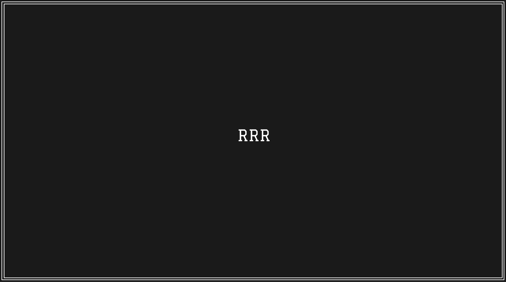

*This is a simple file manager, with a set of functions that, it seems to me, can make it convenient.*
*This is an attempt to get to know ncurses.*

The author does not pretend in any way to the purity of implementation and fidelity of execution. 
So if you think you can do it in a different way, then please do it.


At this stage, the project is launched by cloning this repository and building locally using the installed meson build system.

**Steps:**
1. install meson
2. clone the repository
3. run: meson setup build
4. run the script: . run

**Use:**
- moving is similar to vim (h, j, k, l)
- you use autocompleted in the command: ren <tab> -> rename
- rename selected file - set cursor to the file for change and run (it vim :) - :rename new_file_name
- create file - :touch file_name
- trash - this command to moved file in the your folder by name .trash. Please create your own script trash.sh whish do it and put this script in your sistem folder - bin.
```
for example trash.sh:
mkdir -p $trash
DATE=`date +%Y-%m-%d`
TIME=`date +%H:%M:%S`
for obj in "$@" 
do
  mv $obj $trash
  name=`echo $obj | rev | cut -d '/' -f '1' | rev`
  mv -b $trash/$name $trash/$name.$DATE.$TIME
done
```
- delete - if you want use rm -rf, run - :delete
- create dir - :mkdir dir_name
- select files/dirs - press space. If you want to do: paste, delete, move or trash, then you must first select the file/files/dir/dirs
- quit, it same as vim - :qa

**TESTS:**
- run test: . run test

If your want to run certain tests, please to edit file run.sh
**ATTENTION!!!** this tests created taikint into account my dirs. you must to fix int in the .tests/config.hpp


